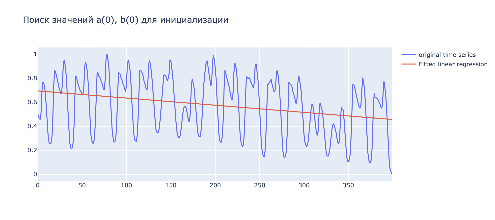
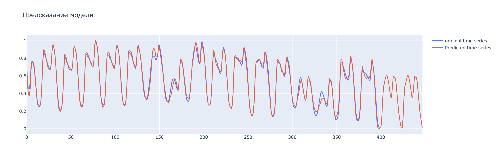

# Цель работы
Реализовать метод Хольта-Уинтерса

# Постановка задачи
Дан временной ряд, в котором наблюдаются сезонные изменения. Необходимо построить прогноз этого ряяда на два периода вперед.

# Описание модели
Строятся три компоненты ряда.
1. Уровень b(t)
2. Тренд a(t)
3. Сезонная компонента s(t), значения в которой получаются в результате сглаживания соответсвующих сезонов в прошлых периодах

