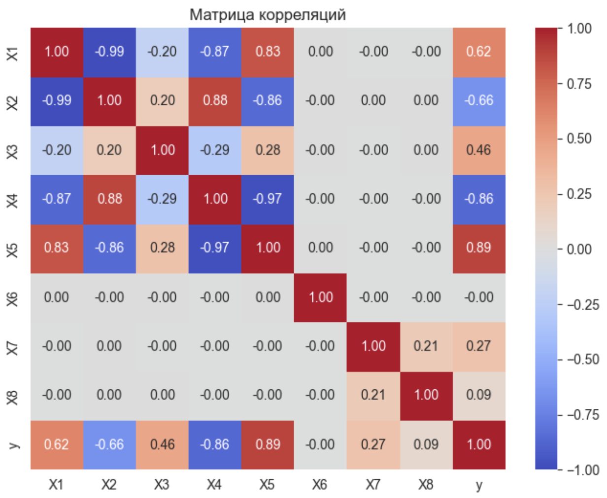
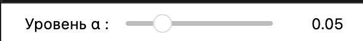
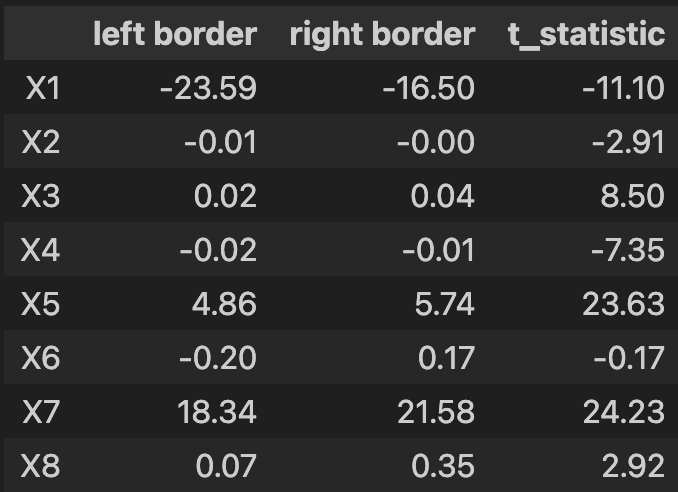
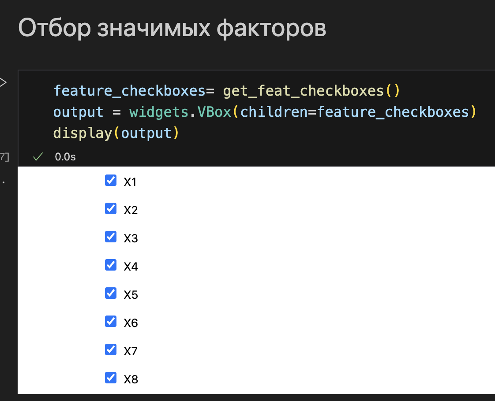

# Цель работы
Реализовать программу, в которой выполнется обучение линейной регресии на факторах, выбранных в результате анализа.

# Постановка задачи
На вход подается файл со значенияями факторов и целевой переменной.

# Описание модели
Строится матрица корреляции факторов
Оценивается статистическая значимость факторов с помощью t-теста. 
Производится обучение линейной регрессии методом наименьших квадратов.
Расчитывается коэффициент детерминации. Значение, близкое к единице интерпретируется, как то, что удалось построить зависимость целевой перменной от выбранных факторов.
Расчитывется значение RMSE.
Производится прогноз при помощи обученной модели и новых данных.

### Процесс работы программы 

